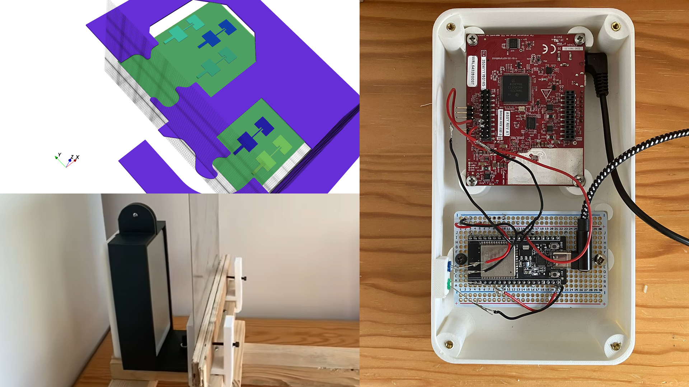

# OpenWaves — open source mmWave radar



[docs](docs/README.md) · [python package](software/pyopenwaves/) · [material classification](software/material_classification_example/) · [fall detection](software/fall_detection_example/) · [hardware](hardware/)

Everything you need to get started with mmWave radar: an electromagnetic simulation you can play with, the antenna, electronics and printable casing, and the software to run two end-to-end demos : material classification and fall detection.

This repo is the open-source release of the radar behind [*I built a mmWave material classification radar*](https://gauthier-lechevalier.com/radar), [discussed on this Hacker News post](https://news.ycombinator.com/item?id=48736137).

## Features

- **`openwaves` Python package** — plug the radar in via USB and drive everything from Python: flash firmware (`openwaves flash`, no TI software needed), send configurations, stream typed point-cloud/heatmap frames. `software/pyopenwaves/`
- **Material classification** — Capon 3D beamforming heatmaps streamed over BLE from the radar, visualized live in [Rerun](https://rerun.io), and classified with a PyTorch neural network. `software/material_classification_example/`
- **Fall detection** — real-time point-cloud tracking on a TI IWRL6432BOOST, with a CNN fall classifier and dual-radar room visualization. `software/fall_detection_example/`
- **Electromagnetic simulation** — antenna, emission and reflection sims built on [openEMS](https://www.openems.de). `hardware/electronics/electromagnetic_simulation/`
- **Hardware included** — antenna design, firmware, and a 3D-printable casing. `hardware/`
- **Recorded data** — `.rrd` / `.npy` radar captures in `software/data/`, so every demo runs without a radar on your desk.

## Get the hardware

Want to run the demos on real hardware without hunting down parts? **The OpenWaves DIY kit is available [here](TODO-STORE-LINK)** — every component in one box: radar board, electronics, battery and casing, ready to assemble yourself following the [docs](docs/README.md). Building your own radar is the best way to understand it — and buying a kit is the best way to support the development of this project.

Prefer to source everything yourself? The repo has you covered: the full [bill of materials](hardware/BOM.md), antenna design, firmware and printable casing live in [hardware/](hardware/).

## Setup

```
pip install -e software/pyopenwaves[viz,ble]
```

Then plug the board in and check it's found:

```
openwaves ports     # list COM ports, mark the radar
openwaves flash     # flash the prebuilt firmware (guided, USB only)
```

In VSCode, **Ctrl+Shift+B** installs everything and `.vscode/` ships one-click
tasks for flashing, streaming and recording. Full walkthrough:
[docs/getting-started.md](docs/getting-started.md).

`pip install -r requirements.txt` additionally pulls the ML and simulation
dependencies for the demos. For the electromagnetic simulations, also
install openEMS & CSXCAD: download the [openEMS release](https://github.com/thliebig/openEMS-Project/releases), unzip it to your `user/opt` dir, then `pip install` the `csxcad` and `openems` wheels from its `python/` folder — full tutorial [here](https://docs.openems.de/python/install.html).

## Docs

Everything lives in [docs/](docs/README.md).

## License

This project is licensed under the [GNU General Public License v3.0](LICENSE).
